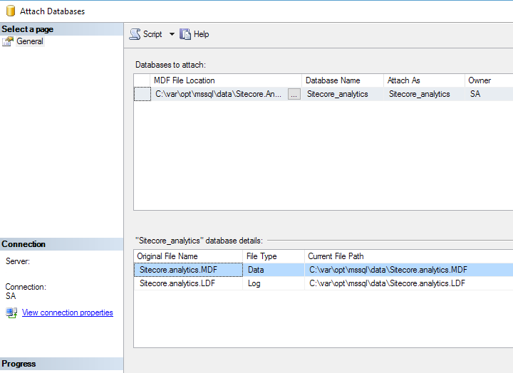

# Setting up SQL Server Linux (Public Preview) on Ubuntu 16.10 on Azure

## Goals
I am excited to see SQL Server finally appear on Linux and I wanted to see if I could get the [Sitecore Publishing Service](http://www.stephenpope.co.uk/publishing) working with the new SQL Server Linux preview. We use some low level SQL calls so I figured it would be a good test of the new version.

More info about SQL Server on Linux can be found here:
https://www.microsoft.com/en-gb/sql-server/sql-server-vnext-including-Linux

## Ubuntu on Azure

First we need to setup our host machine. This is a very straight forward step as Azure has pre-existing images for Ubuntu. For this experiment I chose the 16.10 version of Ubuntu available from Canonical from the Azure portal.

I selected a DS2 v2 machine with 2 cores and 7 gigs of memory

.. as the Microsoft documentation states :

> You need at least 3.25GB of memory to run SQL Server on Linux. SQL Server Engine has been tested up to 1 TB of memory at this time.

## Installing SQL Server

The instructions for install of SQL Server on Ubuntu are very good and [documented here](https://docs.microsoft.com/en-us/sql/linux/sql-server-linux-setup-ubuntu).

It is not worth me just copy/pasting these instructions so it is assumed that you have followed these instructions and have a working version of the SQL Server so that when you issue:

> service mssql-server status

.. you will see something similar to..

.. indicating the service is running correctly.

## Ports and Firewalls

Next step is to open up a port so that we can connect to the machine from the outside world.

To do this we need to find the '**Network Security Group**' node of your Ubuntu install.

It will likely be named :

> (machine name)**-nsg**

.. you should see that it already has a rule added for access to the SSH port. We need to add another one in.

You can select 'MS SQL' from the 'service' drop down and it will fill in some details for you..

Once saved you should now see 2 rules ..

You should now be able to connect via **SQL Management Studio** to see if this has worked.

> For some strange reason I found that you have to specify '**SA**' in *upper-case* in order to connect. No idea why, it just seems that's how its done!

## Uploading and sorting database permissions

Upload the databases you wish to attach using WinSCP or similar program.

*In my example I am uploading the four standard Sitecore databases, web, master, core & analytics*.

The issue here is that they are in the wrong directory and also using the wrong user for SQL to see them. 

We need to switch to **root** in order to have the correct permissions to do the next operations.. so we use:

> sudo su

We are now **root** (so be careful!) and can now switch to the SQL Server data directory..

> cd /var/opt/mssql/data/

.. and move our databases from our home directory to it ..

> mv /home/(username)/Sitecore.* .

We then need to change the permissions so the SQL Server user can see them..

> chown mssql:mssql Sitecore.* 

..so all the databases we moved should have the same user.

## Attaching databases

You can now attach the databases as normal through SQL Management Studio (be sure to browse to the `\var\opt\mssql\data` directory to find the files we have just moved.)

.. now you should be ready to go and can do the rest of your tasks from SQL Management Studio as normal.

## Does it work with Publishing Service ?

Yes! I updated the connection strings on the service and the CD instance to point to my new Azure hosted database and everything worked great! A full publish of a default Sitecore database took 15 seconds (on my local SQL with SSD this takes me ~7 seconds).

>**Disclaimer**: This is just me hacking about to see whats possible, I just tested the publishing service and no other Sitecore features. SQL Server Linux is a preview release so please dont go and push all your stuff onto this for production (even if **@kamsar** says its OK!)

